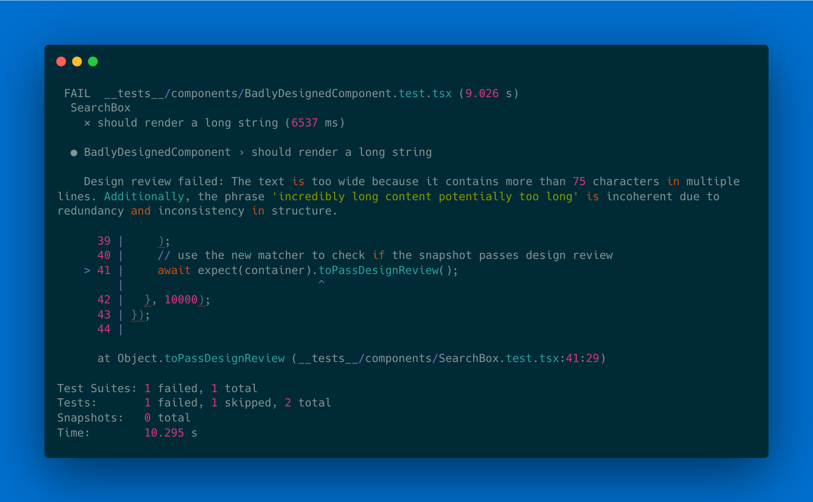

[](https://opensource.org/licenses/MIT)
[](https://www.npmjs.com/package/@vslint/jest)


# vslint (visual eslint) - use AI to enforce UI/UX patterns

**TLDR**: Custom matcher for React testing frameworks that uses multi-modal AI models to enforce UI/UX patterns.
* Supports the Jest testing framework
* Uses chromium to render html snapshots
* Supports Gemini and OpenAI models for analysis

```typescript
import { render } from '@testing-library/react';
import { extendExpectDesignReviewer, DEFAULT_REVIEW_TIMEOUT } from '@vslint/jest';
import Button from '../src/Button'; // Adjust the import path as needed

// extend jest's expect
expect.extend(extendExpectDesignReviewer({
  // global CSS paths that enable correct rendering
  customStyles: ['./styles/globals.css'],
  // set custom UX rules, default rules are in @vslint/jest/rules
  rules: [{
    ruleid: "text-too-wide", description: "If any line of text contains more than 75 characters, mark it as true; otherwise, mark it as false.",
  }],
  // pass the calls through OpenAI's multi-modal models
  model: { modelName: 'gpt-4o-mini', key: process.env.OPENAI_API_KEY }
}));

test('text content that is too wide on desktop screens and is not legible', async () => {
  const { container } = render(<div>Incredibly long content potentially too long. Human readability is best at a maximum of 75 characters</div>);
  // note that the matcher must always be async
  await expect(container).toPassDesignReview();
// setting a timeout here is important, as the model can take a while to respond
}, DEFAULT_REVIEW_TIMEOUT);
```

## Usage
### Jest
```bash
npm install @vslint/jest --save-dev
```

#### Creating the design review matcher
The first step is to extend jest's expect to include a new matcher that performs the design review.
```typescript
import { extendExpectDesignReviewer } from '@vslint/jest';

expect.extend(extendExpectDesignReviewer({
  // optional, where should snapshot files be stored so we don't have to call the model again
  // every time we run tests. Defaults to to '__tests__/__design_snapshots__', but can can be
  // overridden. Will be created if it doesn't exist!
  snapshotsDir: '__tests__/__design_snapshots__',
  // global CSS paths that enable correct rendering
  customStyles: ['./styles/globals.css'],
  // model config to determine which provider to use for analysis
  model: { modelName: 'gpt-4o-mini', key: process.env.OPENAI_API_KEY },
  // optional, defaults to `DEFAULT_RULES` in '@vslint/jest/rules'
  rules: DEFAULT_RULES,
  // optional, sets a custom review endpoint. Override if you are self-hosting a review server
  reviewEndpoint: 'https://vslint-644118703752.us-central1.run.app/api/v1/design-review',
  // optional, sets the log level (or a custom winston logger)
  log: 'debug'
}));
```
| Parameter                | type     | default                  | Description
| ------------------------ | -------- | ------------------------ | -------------------------------------------------------------------------------------------------------------------------- |
| `customStyles`                  | `string[]`   |                          | The path to the css file that is used to generate the hash of the css file and the snapshot.
| `model`                    | `{ modelName: string; key: string }`  |         | API credentials for the design review model. Supported models are `gpt-4o`, `gpt-4o-mini` and `gemini-1.5-flash`
| `snapshotsDir`             | `string`   |  `__tests__/__design_snapshots__`        | The directory where the snapshots are stored.
| `reviewEndpoint`          | `string`   | `https://vslint-644118703752.us-central1.run.app/api/v1/design-review` | The endpoint to use for the review server.
| `log`                     | `string` or `winston.Logger`  | `info`                    | Allows you to set a log level or pass in a custom Winston logger.

#### Using the design review matcher
Now that the matcher is setup, you can use it in your tests to check if the snapshot passes design review. The `toPassDesignReview` method expects to be called on an `HTMLElement`.
```typescript
import { render } from '@testing-library/react';

test('render text that is too long and hard to read', async () => {
  const { container } = render(<div>Incredibly long content potentially too long. Human readability is best at a maximum of 75 characters</div>);
  // it's important to always await the matcher as the design review call is asynchronous
  await expect(container).toPassDesignReview({
    // optional, sets the viewport size to render the content at
    atSize: 'md',
    // optional, sets the log level (or a custom winston logger)
    log: 'debug',
    // optional, if true will store the rendered image next to the snapshot file
    storeRendering: false
  });
});
```

| Parameter                | type     | default                  | Description
| ------------------------ | -------- | ------------------------ | -------------------------------------------------------------------------------------------------------------------------- |
| `atSize`                  | `string` | `{ width: number; height: number;}`   | `{ width: 1920, height: 1080 }`                    | The viewport size to render the content at. Can be `full-screen`, `mobile`, `tablet`, `sm`, `md`, `lg`, `xl`, `2xl`, `3xl`
| `log`                     | `string` or `winston.Logger`  | `info`                    | Allows you to set a log level or pass in a custom Winston logger.
| `storeRendering` | `boolean` | `false` | If `true` will also store the image rendered on the server. This parameter is useful for debugging.

## Deploying a review server
Deploy the dockerfile at `packages/server/Dockerfile` to run a design review server
### Deploying to Google Cloud
Deploy on Google Cloud:
[](https://deploy.cloud.run?git_repo=https://github.com/leohentschker/vslint&revision=main&dir=packages/server)

### Running in your existing backend
You can run this in your existing backend by directly importing the `runReview` call
```typescript
import { runReview } from '@vslint/server';
```

## Security and Privacy concerns
VSLint supports using OpenAI and Gemini models to perform the design review. This means that snapshots are sent to the OpenAI or Gemini API and your API key is being sent to a server.

## License
This project is licensed under the MIT License - see the [LICENSE](LICENSE) file for details.
