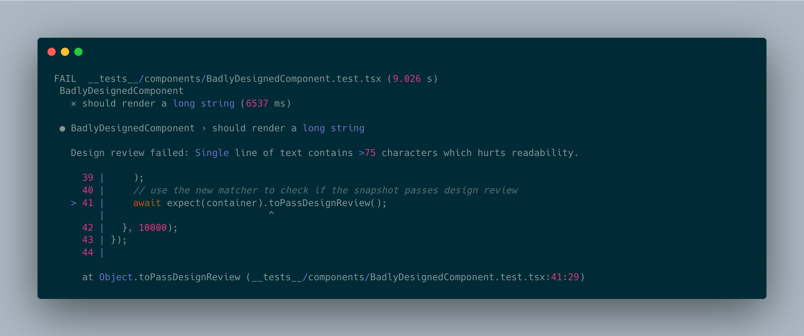
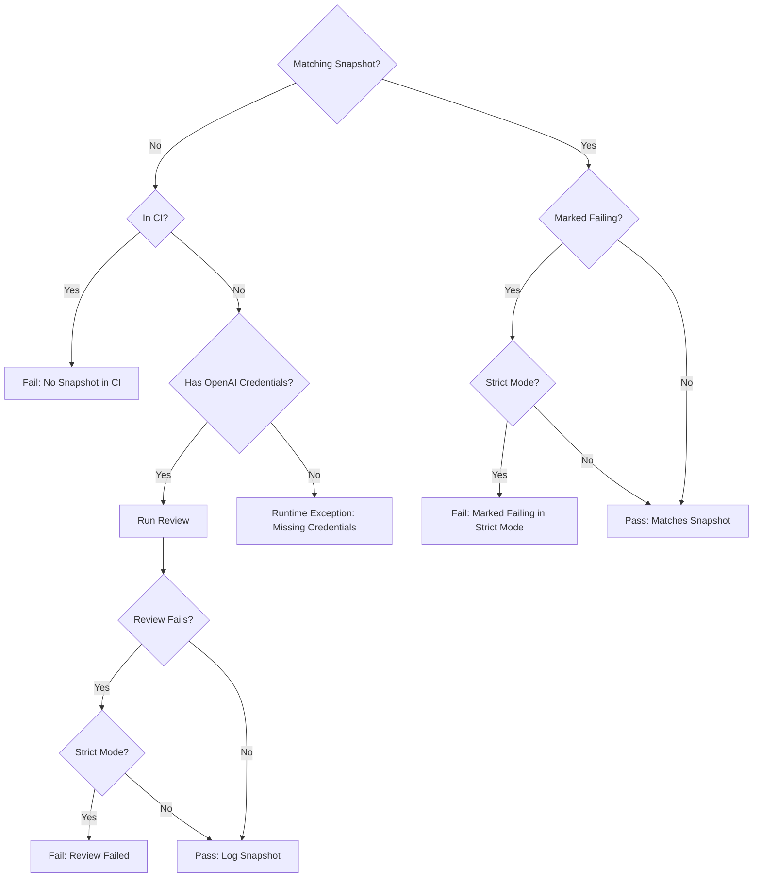

[](https://opensource.org/licenses/MIT)
[](https://www.npmjs.com/package/@vslint/jest)


# vslint (visual eslint) - use AI to enforce UI/UX patterns

**TLDR**: Custom matcher for React testing frameworks that uses multi-modal AI models to enforce UI/UX patterns.
* Supports the Jest and vitest testing frameworks and follows Jest's snapshot testing pattern
* Uses headless Chrome and Puppeteer to render html snapshots
* Supports using OpenAI models for analysis
* Supports running locally, via Dockerfile, or using a free (rate-limited) shared backend

```typescript
import { render } from '@testing-library/react';
import { extendExpectDesignReviewer, DEFAULT_REVIEW_TIMEOUT, DEFAULT_RULES } from '@vslint/jest';
import Button from '../src/Button';

expect.extend(extendExpectDesignReviewer({
  customStyles: ['./styles/globals.css'],
  rules: DEFAULT_RULES,
  model: { modelName: 'gpt-4o-mini', key: process.env.OPENAI_API_KEY }
}));

test('text content that is too wide on desktop screens and is not legible', async () => {
  const { container } = render(<div>Incredibly long content potentially too long. Human readability is best when lines are not as long and have fewer words on a single line, this div should have fewer words, really. It's just rude.</div>);
  await expect(container).toPassDesignReview();
}, DEFAULT_REVIEW_TIMEOUT);
```

## Writing tests
### Jest
```bash
npm install @vslint/jest --save-dev
```

### Vitest
```bash
npm install @vslint/vitest --save-dev
```

### Creating the design review matcher
The first step is to add a new matcher to the testing framework's expect that performs the design review. This should likely be done via the `setupFilesAfterEnv` flag in the testing framework's config.
```typescript
// jest.config.js
module.exports = {
  testEnvironment: "jsdom",
  setupFilesAfterEnv: ["@testing-library/jest-dom", "./setupTests.js"],
  ...
};

// or in vitest.config.js
import { defineConfig } from "vitest/config";
export default defineConfig({
  test: {
    environment: "jsdom",
    setupFiles: "./setupTests.js",
    globals: true,
    ...
  },
});

// setupFiles.js
import { extendExpectDesignReviewer } from '@vslint/jest';

expect.extend(extendExpectDesignReviewer({
  // global CSS paths that enable correct rendering
  customStyles: ['./styles/globals.css'],
  // model config to determine which provider to use for analysis
  model: { modelName: 'gpt-4o-mini', key: process.env.OPENAI_API_KEY },
  // optional, defaults to `DEFAULT_RULES` in '@vslint/shared/rules'
  rules: DEFAULT_RULES,
  // optional, sets a custom review endpoint. Override if you are self-hosting a review server
  reviewEndpoint: 'https://vslint-644118703752.us-central1.run.app/api/v1/design-review',
  // optional, sets the log level (or a custom winston logger)
  log: 'debug'
}));

```
| Parameter                | type              | default       | Description
| ------------------------ | ----------------- | ------------- | -------------- |
| `customStyles`                  | `string[]`   |               | The path to the css file that is used to generate the hash of the css file and the snapshot.
| `strict`                  | `boolean`   | `true`                    | If true, tests will fail if any of the rules fail. If false, the test will pass and the snapshot will be logged with the results.
| `model`                   | `{ modelName: string; key: string }`  |         | API credentials for the design review model. Supported models are `gpt-4o`, `gpt-4o-mini`
| `reviewEndpoint`          | `string`   | `https://vslint-644118703752.us-central1.run.app/api/v1/design-review` | The endpoint to use for the review server. Defaults to a shared review server.
| `log`                     | `string` or `winston.Logger`  | `info`                    | Allows you to set a log level or pass in a custom Winston logger.

### Using the design review matcher
Now that the matcher is setup, you can use it in your tests to check if the snapshot passes design review. The `toPassDesignReview` method expects to be called on an `HTMLElement`. Semantics are the same for Jest and Vitest.
```typescript
import { render } from '@testing-library/react';

test('render text that is too long and hard to read', async () => {
  const { container } = render(<div>Incredibly long content potentially too long. Human readability is best at a maximum of 75 characters</div>);
  // it's important to always await the matcher as the design review call is asynchronous
  await expect(container).toPassDesignReview({
    // optional, sets the viewport size to render the content at
    atSize: 'md',
    // optional, sets the log level (or a custom winston logger)
    log: 'debug'
  });
}, DEFAULT_REVIEW_TIMEOUT);
```

| Parameter                | type     | default                  | Description
| ------------------------ | -------- | ------------------------ | -------------------------------------------------------------------------------------------------------------------------- |
| `atSize`                  | `string` | `{ width: number; height: number;}`   | `{ width: 1920, height: 1080 }`                    | The viewport size to render the content at. Can be `full-screen`, `mobile`, `tablet`, `sm`, `md`, `lg`, `xl`, `2xl`, `3xl`
| `log`                     | `string` or `winston.Logger`  | `info`                    | Allows you to set a log level or pass in a custom Winston logger.
| `strict`                  | `boolean`                    | `true`                    | If true, this test will fail if any of the rules fail. If false, the test will pass and the snapshot will be logged with the failing results. This overrides the global `strict` setting.

### Writing your own UX rules
UX rules are written as JavaScript objects and passed into the `extendExpectDesignReviewer` call. You can view the default rules [here](./packages/shared/src/rules.ts).

Rules are evaluated as part of a multi-modal LLM call, so they can be as complex as you want. Here is an example of a rule that checks if the text is too wide.
```typescript
{
  ruleid: 'text-too-wide',
  description: 'First write out how many words are on each line of text. If a single line of text, as it appears between line breaks (aka newlines), contains more than 30 words, excluding spaces and punctuation, mark it as true and explain which line is too long; otherwise, mark it as false.'
}
```
As usual, the better you are at prompting the more effective your rules will be. One trick to writing good rules is to first ask the model to "focus" on the relevant part of your design. For example in the rule above, we first ask the model to count the words on each line of text before evaluating whether or not the text is too wide.

## Running a review server
### Run using `npx`
```
npx @vslint/server
```
Run the server on a custom port by setting the `PORT` environment variable. You can target this server by setting the `reviewEndpoint` parameter in the `extendExpectDesignReviewer` call to `DEFAULT_LOCAL_REVIEW_ENDPOINT`.

### Deploying to Google Cloud
Deploy the dockerfile at `packages/server/Dockerfile` to run a design review server. You can deploy on Google Cloud by clicking the button below.


[](https://deploy.cloud.run?git_repo=https://github.com/leohentschker/vslint&revision=main&dir=packages/server)

### Running in your existing backend
You can run this in your existing backend by directly importing the `runReview` call
```typescript
import { runReview } from '@vslint/server';
```

### Running using the shared backend
You can run this in the shared backend by setting the `reviewEndpoint` parameter in the `extendExpectDesignReviewer` call to `DEFAULT_REVIEW_ENDPOINT` (this is also the default value).

> ⚠️ **Warning:** The shared backend is not recommended for production use as it is a shared resource and rate limited.

## How do tests pass or fail?
The full logic for how tests pass or fail for both Jest and Vitest is shown below.


## Security and Privacy concerns
VSLint supports using OpenAI to perform the design review as well as a shared backend design review server. While the benefit of using the shared backend is that it's free, this does mean that snapshots are sent to the OpenAI API and that your API key is being sent to a server.

## License
This project is licensed under the MIT License - see the [LICENSE](LICENSE) file for details.